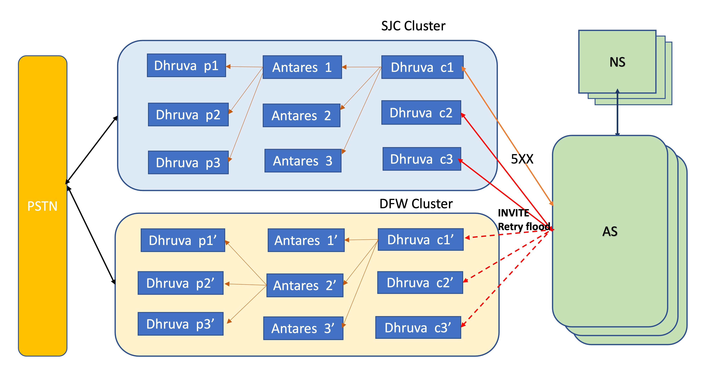

# Error Mapping Design Proposal

## Problem
When Dhruva tries all the PSTN endpoints due to failure with fail-over response code, the same gets forwarded to B2BUA. B2B based on the error code retries the same call on next Dhruva in the cluster.

The end result is not going to change in this case, but has caused flooding of retries.
User impact is delay in the final response of the call to the user (PSTN/Enterprise side).

## Requirements
- INVITE for failure retries needs to be optimised similar to the work done on meetings side.
- We need to support Error Mapping functionality in Dhruva.Response from a given trunk/SG can be mapped to a preconfigured response that needs to be sent out.
- Ability to configure per servergroup/trunk the best response that proxy needs to send to the other party in case of certain failure response code from elements in SG

## Approach
Thought process is to have this logic contained in Application.

- Error mapping is very specific to a given solution
- We can apply logic per callType based on the agreement with Calling , PSTN, B2B teams
- Rest of the call processing in proxy, trunk retains the current behavior and can be re-used across solutions.

*Scenario between Dhruva Proxy and Antares*


*Scenario between Dhruva Proxy clusters and Calling Core*

*Invite flood caused by AS retry mechanism*

Let's consider below scenario.

- AS tries Dhruva C1 instance for calling out to a PSTN endpoint
- C1 instance of proxy tries all Antares instances due to failure within the cluster
- C1 instance of proxy  returns back 502 back to AS
- AS retries to C2 instance of proxy, resulting in same behavior.
- Based on above AS will end up retrying all the Dhruva instances with no change in behavior and degrading user experience
- Ideally AS can fallback to second cluster of Dhruva incase of first failure


## App configuration

### Option 1

```yaml
errorMapper:
  -
    mappedResponseCode: 502
    mappedReasonPhrase: "exhausted all retries, do not try any further"
    callTypes: [DialInPSTN, DialInB2B]
    errorCodes:
      -
        code: 503
      -
        code: 408
  -
    mappedResponseCode: 504
    reasonPhrase: "Do not retry"
    callTypes: [DialOutWxC]
    errorCodes:
      -
        code: 600
      -
        code: 500
```

### Option 2

```yaml
app:
  DialInPSTN:
    errorMappingPolicy: antaresErrorPolicy
common:   
  errorMappingPolicy:
    antaresErrorPolicy:
      name: antaresErrorPolicy
      mappings:
        -
          mappedResponseCode: 502
          mappedReasonPhrase: "Something went bad"
          errorCodes:
            -
              code: 503
            -
              code: 408

        -
          mappedResponseCode: 504
          reasonPhrase: "Do not retry"
          errorCodes:
            -
              code: 600
            -
              code: 500

```

## App code

Introduce a new Map function in pipeline after handleEgress in CallType Interface.

The function transforms the response to the mapped response based on config supplied.

We have the proxyResponse sent by downstream element Or it could be generated by proxy

*Sample Code Snippet*

```java

trunkManager
    .handleEgress(getEgressTrunk(), proxySIPRequest, egress, getNormalization())
        .map(proxySIPResponse -> {
          System.out.println("received response");
          try {
            proxySIPResponse.getResponse().setStatusCode(505);
            proxySIPResponse.getResponse().setReasonPhrase("do not retry");
          } catch (ParseException e) {
            e.printStackTrace();
          }
 
          return proxySIPResponse;
        })
```

**Inject the new config to CallingAppConfigurationProperty**

```java
@Component
@EnableConfigurationProperties
@ConfigurationProperties(prefix = "app")
@RefreshScope
public class CallingAppConfigurationProperty {
  @NotBlank @Getter @Setter private String networkPSTN;
  @NotBlank @Getter @Setter private String networkB2B;
  @NotBlank @Getter @Setter private String networkCallingCore;
  @NotBlank @Getter @Setter private String b2bEgress;
  @NotBlank @Getter @Setter private String callingEgress;
  @NotBlank @Getter @Setter private String pstnIngress;
  @NonBlank @Getter @Setter private String errorMapper;
}
 
  @Autowired
  public DialInPSTN(
      TrunkManager trunkManager,
      CallingAppConfigurationProperty configurationProperty,
      DialInPSTNNorm dialInPSTNNorm) {
    this.trunkManager = trunkManager;
    this.configurationProperty = configurationProperty;
    this.normalization = dialInPSTNNorm;
  }
```

## Open Items
- For mapped response, Any custom response code and header/param that we need to create based on discussions with Antares/Calling/Ops team.
- Do we need to create a new mapped response OR is it ok to modify the current response itself.
  - Recommendation: To modify the current response.Anyways the stack and proxy will not store the context of this response and transaction would have terminated.App being stateless, we can modify the response as per the needs.
- Mid Dialog requests - mostly no change required here.

## References
[`PSTN fallback overview`](https://wiki.cisco.com/display/WEBEXENG/F9124+PSTN+Fallback+Support#F9124PSTNFallbackSupport-Overview) 

[`Cloud Proxy reference`](https://wiki.cisco.com/display/WX2/Mapped+response+and+X-Cisco-Internal-Reason+header+feature)


## Meeting Notes and solution level agreements

MoM for Invite flood retry solution

Contract between Dhruva proxy and Antares in WxC pstn solution

- Dhruva proxy to map any 503 response code from either SP or calling core to 502 response code towards Antares.This is to avoid Antares retries on subsequent Dhruva instances
- Dhruva proxy to map 408 response to 502 towards Antares.Dhruva proxy will try other instances incase of timeout
- Dhruva proxy to only include [503, 408] as failover response codes for Antares server group.

### AI's
*Antares team*
- To map 404 (incase of time timeout, 503's) response code to 502
Jira link: https://jira-eng-gpk2.cisco.com/jira/browse/WEBEX-279895
- Discussion with calling team(AS and NS) to define the contract to avoid retries.